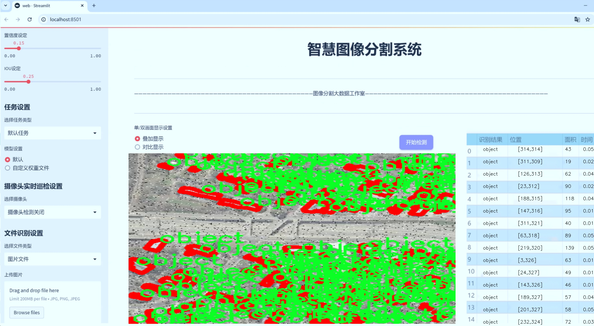
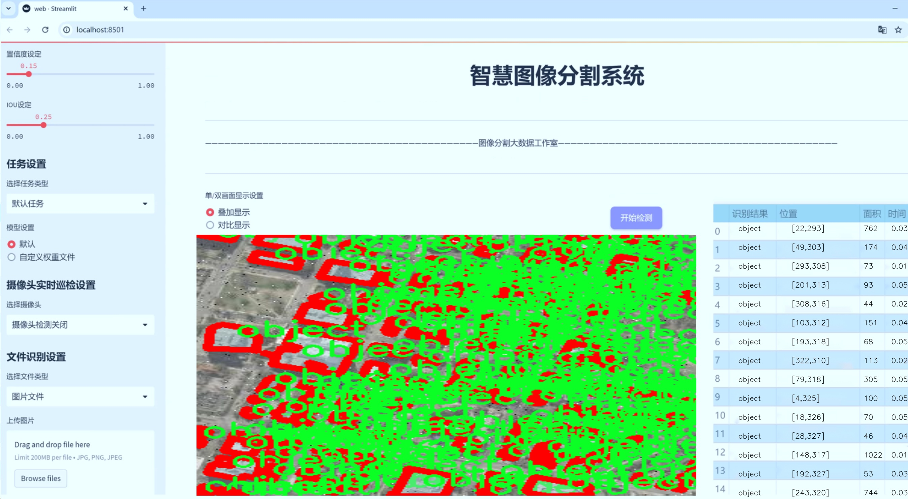
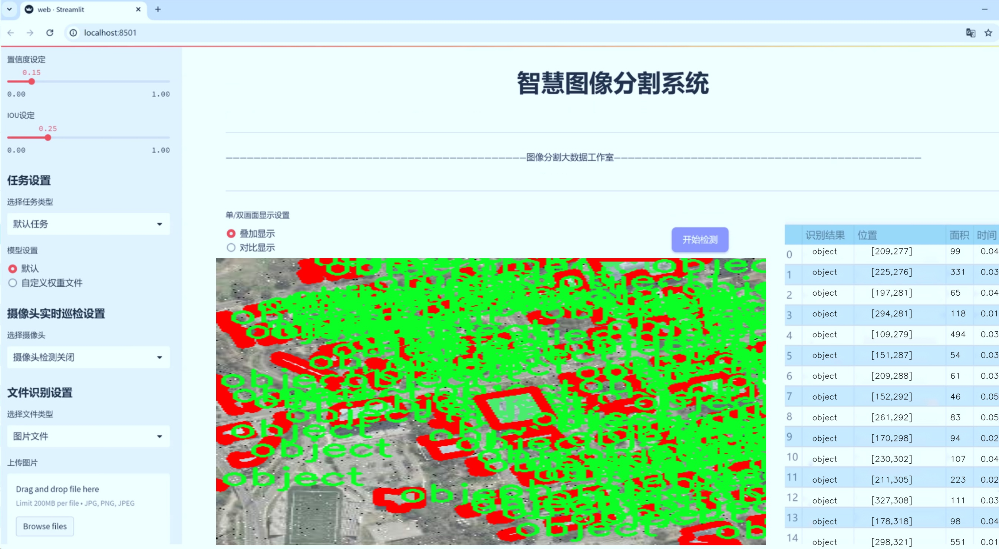
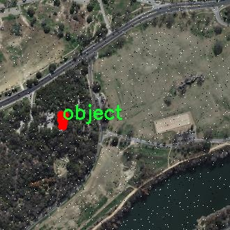
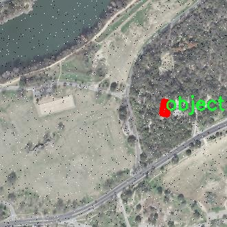
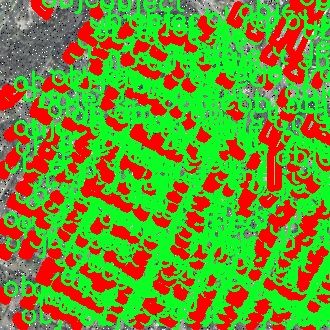
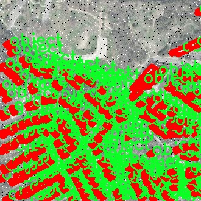

# 遥感建筑物图像分割系统： yolov8-seg-attention

### 1.研究背景与意义

[参考博客](https://gitee.com/YOLOv8_YOLOv11_Segmentation_Studio/projects)

[博客来源](https://kdocs.cn/l/cszuIiCKVNis)

研究背景与意义

随着遥感技术的迅速发展，遥感图像的获取和处理能力不断提升，尤其是在城市规划、环境监测和灾害评估等领域，遥感图像的应用愈发广泛。建筑物作为城市景观的重要组成部分，其准确的识别与分割对于城市管理、资源配置和环境保护等方面具有重要意义。传统的建筑物提取方法多依赖于人工特征提取和分类，效率低下且易受环境因素的影响，难以满足现代城市快速发展的需求。因此，基于深度学习的图像分割技术逐渐成为研究的热点。

YOLO（You Only Look Once）系列模型以其高效的实时目标检测能力而受到广泛关注。YOLOv8作为该系列的最新版本，进一步提升了检测精度和速度，具有良好的应用前景。然而，YOLOv8在处理复杂场景中的建筑物分割任务时，仍然面临一些挑战，如小目标的检测、遮挡物的影响以及不同建筑物形状的多样性等。因此，改进YOLOv8以适应遥感建筑物图像分割的需求，成为了一个亟待解决的问题。

本研究旨在基于改进的YOLOv8模型，构建一个高效的遥感建筑物图像分割系统。我们将利用包含2100幅图像的Mask RCNN数据集，该数据集专注于实例分割任务，涵盖了建筑物这一类别。通过对该数据集的深入分析，我们将探索如何优化YOLOv8的网络结构和训练策略，以提高其在建筑物分割任务中的表现。具体而言，我们将针对建筑物的形状、大小及其在不同环境中的表现，设计相应的改进措施，包括但不限于数据增强、特征提取层的调整以及损失函数的优化。

本研究的意义不仅在于提升遥感建筑物图像分割的精度和效率，更在于为相关领域提供一种新的技术路径。通过构建高效的分割系统，我们能够为城市规划提供更为精准的数据支持，帮助决策者在资源配置和环境管理中做出更为科学的判断。此外，该系统还可以应用于灾后重建、城市扩展监测等实际场景，为应对城市化进程中的各种挑战提供技术保障。

综上所述，基于改进YOLOv8的遥感建筑物图像分割系统的研究，具有重要的理论价值和实际应用意义。它不仅能够推动遥感图像处理技术的发展，还将为城市管理和环境保护提供切实可行的解决方案。通过这一研究，我们期望能够为遥感领域的学术研究和实际应用提供新的思路和方法，促进相关技术的进步与创新。

### 2.图片演示







注意：本项目提供完整的训练源码数据集和训练教程,由于此博客编辑较早,暂不提供权重文件（best.pt）,需要按照6.训练教程进行训练后实现上图效果。

### 3.视频演示

[3.1 视频演示](https://www.bilibili.com/video/BV1tezzYhEoF/)

### 4.数据集信息

##### 4.1 数据集类别数＆类别名

nc: 1
names: ['object']


##### 4.2 数据集信息简介

数据集信息展示

在本研究中，我们采用了“Mask RCNN”数据集，以支持对遥感建筑物图像分割系统的训练，特别是针对改进的YOLOv8-seg模型。该数据集的设计旨在为建筑物的精确分割提供高质量的标注数据，确保模型在实际应用中的有效性和可靠性。数据集的类别数量为1，类别列表中仅包含一个类别，即“object”。这一设计反映了我们研究的重点，即专注于建筑物的分割，而不涉及其他物体或背景元素的干扰。

“Mask RCNN”数据集的构建过程经过严格的筛选和标注，确保每一幅图像都能准确地反映出建筑物的轮廓和特征。遥感图像通常具有高分辨率和丰富的细节，能够提供建筑物的立体信息，这对于训练深度学习模型至关重要。数据集中包含的图像来源于不同的地理区域和环境条件，涵盖了城市、乡村以及不同气候下的建筑物。这种多样性使得模型在面对不同场景时能够具备更强的适应性和鲁棒性。

在数据集的标注过程中，采用了先进的图像分割技术，确保每个建筑物的边界都被精确地勾勒出来。通过使用像素级的标注，模型能够学习到建筑物的细微特征，包括形状、大小以及相对位置等。这种精细化的标注方式为后续的模型训练提供了坚实的基础，使得YOLOv8-seg能够在分割任务中实现更高的准确率和召回率。

此外，数据集的预处理环节也不可忽视。为了提高模型的训练效率和效果，我们对图像进行了多种增强处理，如旋转、缩放、裁剪等。这些操作不仅增加了数据集的多样性，还有效防止了模型的过拟合现象。通过这种方式，模型能够在不同的输入条件下保持良好的性能，从而提升了其在实际应用中的可用性。

在模型训练过程中，我们将“Mask RCNN”数据集分为训练集和验证集，以便于对模型的性能进行评估。训练集用于模型的学习，而验证集则用于监测模型在未见数据上的表现。通过这种方式，我们能够及时调整模型的参数和结构，确保其在建筑物图像分割任务中的最佳表现。

总之，“Mask RCNN”数据集为改进YOLOv8-seg的遥感建筑物图像分割系统提供了重要的支持。其单一类别的设计使得研究者能够专注于建筑物的特征提取与分割，而高质量的标注和多样化的图像来源则为模型的训练提供了坚实的基础。通过充分利用这一数据集，我们期望能够实现更高效、更准确的建筑物图像分割，为遥感技术在城市规划、环境监测等领域的应用提供强有力的支持。










### 5.项目依赖环境部署教程（零基础手把手教学）

[5.1 环境部署教程链接（零基础手把手教学）](https://www.bilibili.com/video/BV1jG4Ve4E9t/?vd_source=bc9aec86d164b67a7004b996143742dc)


[5.2 安装Python虚拟环境创建和依赖库安装视频教程链接（零基础手把手教学）](https://www.bilibili.com/video/BV1nA4VeYEze/?vd_source=bc9aec86d164b67a7004b996143742dc)

### 6.手把手YOLOV8-seg训练视频教程（零基础手把手教学）

[6.1 手把手YOLOV8-seg训练视频教程（零基础小白有手就能学会）](https://www.bilibili.com/video/BV1cA4VeYETe/?vd_source=bc9aec86d164b67a7004b996143742dc)


按照上面的训练视频教程链接加载项目提供的数据集，运行train.py即可开始训练



     Epoch   gpu_mem       box       obj       cls    labels  img_size
     1/200     0G   0.01576   0.01955  0.007536        22      1280: 100%|██████████| 849/849 [14:42<00:00,  1.04s/it]
               Class     Images     Labels          P          R     mAP@.5 mAP@.5:.95: 100%|██████████| 213/213 [01:14<00:00,  2.87it/s]
                 all       3395      17314      0.994      0.957      0.0957      0.0843

     Epoch   gpu_mem       box       obj       cls    labels  img_size
     2/200     0G   0.01578   0.01923  0.007006        22      1280: 100%|██████████| 849/849 [14:44<00:00,  1.04s/it]
               Class     Images     Labels          P          R     mAP@.5 mAP@.5:.95: 100%|██████████| 213/213 [01:12<00:00,  2.95it/s]
                 all       3395      17314      0.996      0.956      0.0957      0.0845

     Epoch   gpu_mem       box       obj       cls    labels  img_size
     3/200     0G   0.01561    0.0191  0.006895        27      1280: 100%|██████████| 849/849 [10:56<00:00,  1.29it/s]
               Class     Images     Labels          P          R     mAP@.5 mAP@.5:.95: 100%|███████   | 187/213 [00:52<00:00,  4.04it/s]
                 all       3395      17314      0.996      0.957      0.0957      0.0845


### 7.50+种全套YOLOV8-seg创新点加载调参实验视频教程（一键加载写好的改进模型的配置文件）

[7.1 50+种全套YOLOV8-seg创新点加载调参实验视频教程（一键加载写好的改进模型的配置文件）](https://www.bilibili.com/video/BV1Hw4VePEXv/?vd_source=bc9aec86d164b67a7004b996143742dc)

### YOLOV8-seg算法简介

原始YOLOv8-seg算法原理

YOLOv8-seg算法是YOLO系列中的最新成员，代表了计算机视觉领域在目标检测和实例分割任务中的重要进展。相较于前一代的YOLOv5，YOLOv8在检测精度和推理速度上都实现了显著的提升，成为了当前业界最为流行和成功的模型之一。YOLOv8不仅在目标检测中表现出色，还扩展了其功能，支持实例分割任务，进一步提升了其应用范围和灵活性。

YOLOv8的网络结构主要由四个部分组成：输入端、骨干网络、颈部网络和头部网络。输入端通过马赛克数据增强、自适应锚框计算和自适应灰度填充等技术，为后续的特征提取和处理奠定了基础。马赛克数据增强能够有效提高模型的鲁棒性，而自适应锚框计算则通过动态调整锚框的大小和形状，提升了模型对不同目标的适应能力。

在骨干网络部分，YOLOv8采用了C2f结构和空间金字塔池化融合（SPPF）模块。C2f模块是对残差特征进行学习的主要模块，其设计灵感来源于YOLOv7的ELAN结构，通过引入更多的分支跨层连接，增强了模型的梯度流动性。这种设计使得YOLOv8能够更好地捕捉到多层次的特征信息，从而提升了特征表示能力。SPPF模块则通过多尺度特征融合，进一步增强了模型对不同尺寸目标的检测能力。

颈部网络采用了路径聚合网络（PAN）结构，这一设计使得YOLOv8在处理不同缩放尺度的对象时，能够更有效地融合特征。PAN结构通过将来自不同层次的特征进行聚合，提升了模型对复杂场景的理解能力。这种特征融合的策略使得YOLOv8在面对复杂背景和多目标场景时，依然能够保持较高的检测精度。

头部网络是YOLOv8的核心部分，其主要功能是解耦分类和检测过程。YOLOv8的头部网络包括损失计算和目标检测框筛选两个主要环节。在损失计算中，YOLOv8采用了Task-Aligned Assigner分配策略，根据分类与回归的分数加权结果选择正样本。这一策略的引入，使得模型在训练过程中能够更好地平衡正负样本的分配，提高了训练效率和检测精度。

在损失计算方面，YOLOv8的分类分支采用了二元交叉熵损失（BCELoss），而回归分支则结合了分布焦点损失（DFLoss）和完全交并比损失函数（CIOULoss）。这种多损失函数的设计，使得YOLOv8在边界框预测时，能够更准确地捕捉目标的边界信息，进而提升了检测的精度。

YOLOv8的创新点还体现在其新的Anchor-Free检测头的引入。这一设计使得YOLOv8在目标检测时不再依赖于传统的锚框预测，从而减少了计算复杂度，加速了非最大抑制（NMS）过程。这一变化不仅提升了模型的推理速度，还使得YOLOv8在处理小目标和高分辨率图像时，表现得更加出色。

此外，YOLOv8的模型结构也进行了优化，骨干网络中的C3模块被更为高效的C2f结构所替代，减少了冗余的卷积连接层。这一优化使得YOLOv8在保持高性能的同时，进一步实现了轻量化，适应了更多硬件平台的需求。

YOLOv8的设计理念不仅注重模型的性能提升，还强调了其工程化的简洁易用性。通过提供原生支持自定义数据集的功能，YOLOv8使得用户能够更方便地进行模型训练和调整。这一特性极大地降低了使用门槛，使得更多的研究者和开发者能够在其基础上进行创新和应用。

综上所述，YOLOv8-seg算法的原理体现了现代计算机视觉领域在目标检测和实例分割任务中的最新发展趋势。通过引入先进的网络结构、优化的损失计算策略以及高效的特征融合方法，YOLOv8不仅在精度和速度上超越了前代模型，还为广泛的应用场景提供了强有力的支持。随着YOLOv8的不断发展和完善，预计将在更多实际应用中发挥重要作用，推动计算机视觉技术的进一步进步。


### 9.系统功能展示（检测对象为举例，实际内容以本项目数据集为准）

图9.1.系统支持检测结果表格显示

  图9.2.系统支持置信度和IOU阈值手动调节

  图9.3.系统支持自定义加载权重文件best.pt(需要你通过步骤5中训练获得)

  图9.4.系统支持摄像头实时识别

  图9.5.系统支持图片识别

  图9.6.系统支持视频识别

  图9.7.系统支持识别结果文件自动保存

  图9.8.系统支持Excel导出检测结果数据


### 10.50+种全套YOLOV8-seg创新点原理讲解（非科班也可以轻松写刊发刊，V11版本正在科研待更新）

#### 10.1 由于篇幅限制，每个创新点的具体原理讲解就不一一展开，具体见下列网址中的创新点对应子项目的技术原理博客网址【Blog】：


[10.1 50+种全套YOLOV8-seg创新点原理讲解链接](https://gitee.com/qunmasj/good)

#### 10.2 部分改进模块原理讲解(完整的改进原理见上图和技术博客链接)【如果此小节的图加载失败可以通过CSDN或者Github搜索该博客的标题访问原始博客，原始博客图片显示正常】

### YOLOv8简介
继YOLOv5之后,Ultralytics公司在2023年1月发布了YOLOv8,该版本可以用于执行目标检测、实例分割和图像分类任务。整个网络结构由4部分组成:输入图像, Backbone主干网络获得图像的特征图, Head检测头预测目标对象和位置, Neck融合不同层的特征并将图像特征传递到预测层。
1)相比于YOLOv5和 YOLOv7算法,YOLOv8在训练时间和检测精度上得到极大提升,而且模型的权重文件只有6 MB,可以部署到任一嵌入式设备中,它凭借自身快速、高效的性能可以很好地满足实时检测的需求。
2)由于YOLOv8算法是YOLOv5的继承版本，对应提供了N、S、 M、L、X 等不同尺度的模型,用于满足不同场景的需求,在精度得到大幅提升的同时,能流畅地训练,并且能安装在各种硬件平台上运行。
3)在输入端,YOLOv8算法使用了Mosaic数据增强[15]、自适应锚框计算[16]等方法。Mosaic数据增强是通过随机缩放、随机裁剪、随机排布的方式进行拼接,丰富检测数据集。自适应锚框计算是网络在初始锚框的基础上输出预测框,通过差值计算、反向更新等操作计算出最佳锚框值。
4)在输出端,YOLOv8算法使用解耦头替换了以往的耦合头,将分类和回归解耦为两个独立的分支,通过解耦使各个任务更加专注,从而解决复杂场景下定位不准及分类错误的问题。


### OREPA：在线卷积重参数化
卷积神经网络(CNNs)已经在许多计算机视觉任务的应用成功，包括图像分类、目标检测、语义分割等。精度和模型效率之间的权衡也已被广泛讨论。

一般来说，一个精度较高的模型通常需要一个更复杂的块，一个更宽或更深的结构。然而，这样的模型总是太重，无法部署，特别是在硬件性能有限、需要实时推理的场景下。考虑到效率，更小、更紧凑和更快的模型自然是首选。

为了获得一个部署友好且高精度的模型，有研究者提出了基于结构重参数化的方法来释放性能。在这些方法中，模型在训练阶段和推理阶段有不同的结构。具体来说，使用复杂的训练阶段拓扑，即重参数化的块，来提高性能。训练结束后，通过等效变换将一个复杂的块重参为成一个单一的线性层。重参后的模型通常具有一个整洁架构模型，例如，通常是一个类似VGG的或一个类似ResNet的结构。从这个角度来看，重参化策略可以在不引入额外的推理时间成本的情况下提高模型的性能。


BN层是重构模型的关键组成部分。在一个重新解析块(图1(b))中，在每个卷积层之后立即添加一个BN层。可以观察到，去除这些BN层会导致的性能退化。然而，当考虑到效率时，这种BN层的使用出乎意料地在训练阶段带来了巨大的计算开销。在推理阶段，复杂的块可以被压缩成一个卷积层。但是，在训练过程中，BN层是非线性的，也就是说，它们将特征映射除以它的标准差，这就阻止了合并整个块。因此，存在大量的中间计算操作(large FLOPS)和缓冲特征映射(high memory usage)。更糟糕的是，这么高的训练预算使得很难探索更复杂和可能更强的重参块。很自然地，下面的问题就出现了：

为什么标准化在重参中这么重要？

通过分析和实验，作者认为BN层中的尺度因子最重要，因为它们能够使不同分支的优化方向多样化。

基于观察结果，作者提出了在线重参化(OREPA)(图1(c))，这是一个两阶段的pipeline，使之能够简化复杂的training-time re-param block。

在第一阶段，block linearization，去除所有的非线性BN层，并引入线性缩放层。这些层与BN层具有相似的性质，因此它们使不同分支的优化多样化。此外，这些层都是线性的，可以在训练过程中合并成卷积层。

第二阶段，block squeezing，将复杂的线性块简化为单一的卷积层。OREPA通过减少由中间计算层引起的计算和存储开销，显著降低了训练成本，对性能只有非常小的影响。

此外，高效化使得探索更复杂的重参化拓扑成为可能。为了验证这一点，作者进一步提出了几个重参化的组件，以获得更好的性能。

在ImageNet分类任务上评估了所提出的OREPA。与最先进的修复模型相比，OREPA将额外的训练时间GPU内存成本降低了65%到75%，并将训练过程加快了1.5-2.3倍。同时，OREPA-ResNet和OREPA-VGG的性能始终优于+0.2%∼+0.6%之前的DBB和RepVGG方法。同时作者还评估了在下游任务上的OREPA，即目标检测和语义分割。作者发现OREPA可以在这些任务上也可以带来性能的提高。

提出了在线卷积重参化(OREPA)策略，这极大地提高了重参化模型的训练效率，并使探索更强的重参化块成为可能；

通过对重参化模型工作机制的分析，用引入的线性尺度层代替BN层，这仍然提供了不同的优化方向，并保持了表示能力;

在各种视觉任务上的实验表明，OREPA在准确性和训练效率方面都优于以前的重参化模型(DBB/RepVGG)。


#### 结构重参化
结构重参化最近被重视并应用于许多计算机视觉任务，如紧凑模型设计、架构搜索和剪枝。重参化意味着不同的架构可以通过参数的等价转换来相互转换。例如，1×1卷积的一个分支和3×3卷积的一个分支，可以转移到3×3卷积的单个分支中。在训练阶段，设计了多分支和多层拓扑来取代普通的线性层(如conv或全连接层)来增强模型。Cao等讨论了如何在训练过程中合并深度可分离卷积核。然后在推理过程中，将训练时间的复杂模型转移到简单模型中，以便于更快的推理。

在受益于复杂的training-time拓扑，同时，当前的重参化方法训练使用不可忽略的额外计算成本。当块变得更复杂以变得更强的表示时，GPU内存利用率和训练时间将会越来越长，最终走向不可接受。与以往的重参化方法不同，本文更多地关注训练成本。提出了一种通用的在线卷积重参化策略，使training-time的结构重参化成为可能。


#### Normalization
BN被提出来缓解训练非常深度神经网络时的梯度消失问题。人们认为BN层是非常重要的，因为它们平滑了损失。最近关于无BN神经网络的研究声称，BN层并不是不可或缺的。通过良好的初始化和适当的正则化，可以优雅地去除BN层。

对于重参化模型，作者认为重参化块中的BN层是关键的。无BN的变体将会出现性能下降。然而，BN层是非线性的，也就是说，它们将特征图除以它的标准差，这阻止了在线合并块。为了使在线重参化可行，作者去掉了重参块中的所有BN层，并引入了BN层的线性替代方法，即线性缩放层。

#### 卷积分解
标准卷积层计算比较密集，导致大的FLOPs和参数量。因此，卷积分解方法被提出，并广泛应用于移动设备的轻量化模型中。重参化方法也可以看作是卷积分解的某种形式，但它更倾向于更复杂的拓扑结构。本文的方法的不同之处在于，在kernel-level上分解卷积，而不是在structure level。

#### 在线重参化
在本节中，首先，分析了关键组件，即重参化模型中的BN层，在此基础上提出了在线重参化(OREPA)，旨在大大减少再参数化模型的训练时间预算。OREPA能够将复杂的训练时间块简化为一个卷积层，并保持了较高的精度。

OREPA的整体pipeline如图所示，它包括一个Block Linearization阶段和一个Block Squeezing阶段。


参考该博客通过分析多层和多分支结构的优化多样性，深入研究了重参化的有效性，并证明了所提出的线性缩放层和BN层具有相似的效果。

最后，随着训练预算的减少，进一步探索了更多的组件，以实现更强的重参化模型，成本略有增加。

#### 重参化中的Normalization
作者认为中间BN层是重参化过程中多层和多分支结构的关键组成部分。以SoTA模型DBB和RepVGG为例，去除这些层会导致严重的性能下降，如表1所示。


这种观察结果也得到了Ding等人的实验支持。因此，作者认为中间的BN层对于重参化模型的性能是必不可少的。

然而，中间BN层的使用带来了更高的训练预算。作者注意到，在推理阶段，重参化块中的所有中间操作都是线性的，因此可以合并成一个卷积层，从而形成一个简单的结构。

但在训练过程中，BN层是非线性的，即它们将特征映射除以其标准差。因此，中间操作应该单独计算，这将导致更高的计算和内存成本。更糟糕的是，如此高的成本将阻止探索更强大的训练模块。

#### Block Linearization
如3.1中所述，中间的BN层阻止了在训练过程中合并单独的层。然而，由于性能问题，直接删除它们并不简单。为了解决这一困境，作者引入了channel级线性尺度操作作为BN的线性替代方法。

缩放层包含一个可学习的向量，它在通道维度中缩放特征映射。线性缩放层具有与BN层相似的效果，它们都促进多分支向不同的方向进行优化，这是重参化时性能提高的关键。除了对性能的影响外，线性缩放层还可以在训练过程中进行合并，使在线重参化成为可能。


基于线性缩放层，作者修改了重参化块，如图所示。具体来说，块的线性化阶段由以下3个步骤组成：

首先，删除了所有的非线性层，即重参化块中的BN层

其次，为了保持优化的多样性，在每个分支的末尾添加了一个缩放层，这是BN的线性替代方法

最后，为了稳定训练过程，在所有分支的添加后添加一个BN层。

一旦完成线性化阶段，在重参化块中只存在线性层，这意味着可以在训练阶段合并块中的所有组件。

#### Block Squeezing
Block Squeezing步骤将计算和内存昂贵的中间特征映射上的操作转换为更经济的kernel上的操作。这意味着在计算和内存方面从减少到，其中、是特征图和卷积核的空间尺寸。

一般来说，无论线性重参化块是多么复杂，以下2个属性始终成立：

Block中的所有线性层，例如深度卷积、平均池化和所提出的线性缩放，都可以用带有相应参数的退化卷积层来表示;

Block可以由一系列并行分支表示，每个分支由一系列卷积层组成。

有了上述两个特性，如果可以将

多层（即顺序结构）

多分支（即并行结构）

简化为单一卷积，就可以压缩一个块。在下面的部分中，将展示如何简化顺序结构(图(a))和并行结构(图(b))。


### 11.项目核心源码讲解（再也不用担心看不懂代码逻辑）

#### 11.1 ultralytics\hub\auth.py

以下是对代码的核心部分进行的分析和详细中文注释：

```python
import requests  # 导入requests库，用于发送HTTP请求

# 定义API的根URL
from ultralytics.hub.utils import HUB_API_ROOT, HUB_WEB_ROOT, PREFIX, request_with_credentials
from ultralytics.utils import LOGGER, SETTINGS, emojis, is_colab

API_KEY_URL = f'{HUB_WEB_ROOT}/settings?tab=api+keys'  # API密钥设置的URL


class Auth:
    """
    处理身份验证过程，包括API密钥处理、基于cookie的身份验证和头部生成。

    支持的身份验证方法：
    1. 直接使用API密钥。
    2. 使用浏览器cookie进行身份验证（特别是在Google Colab中）。
    3. 提示用户输入API密钥。

    属性：
        id_token (str or bool): 用于身份验证的令牌，初始化为False。
        api_key (str or bool): 用于身份验证的API密钥，初始化为False。
        model_key (bool): 模型密钥的占位符，初始化为False。
    """
    id_token = api_key = model_key = False  # 初始化属性

    def __init__(self, api_key='', verbose=False):
        """
        使用可选的API密钥初始化Auth类。

        参数：
            api_key (str, optional): 可能是API密钥或组合API密钥和模型ID。
        """
        api_key = api_key.split('_')[0]  # 分割输入的API密钥，保留API密钥部分

        # 设置API密钥属性
        self.api_key = api_key or SETTINGS.get('api_key', '')

        # 如果提供了API密钥
        if self.api_key:
            # 如果提供的API密钥与设置中的API密钥匹配
            if self.api_key == SETTINGS.get('api_key'):
                if verbose:
                    LOGGER.info(f'{PREFIX}Authenticated ✅')  # 记录已认证信息
                return
            else:
                success = self.authenticate()  # 尝试使用提供的API密钥进行身份验证
        elif is_colab():  # 如果没有提供API密钥且环境为Google Colab
            success = self.auth_with_cookies()  # 尝试使用cookie进行身份验证
        else:
            success = self.request_api_key()  # 请求API密钥

        # 更新设置中的API密钥
        if success:
            SETTINGS.update({'api_key': self.api_key})  # 更新设置
            if verbose:
                LOGGER.info(f'{PREFIX}New authentication successful ✅')  # 记录新认证成功信息
        elif verbose:
            LOGGER.info(f'{PREFIX}Retrieve API key from {API_KEY_URL}')  # 记录获取API密钥的URL

    def request_api_key(self, max_attempts=3):
        """
        提示用户输入API密钥。

        返回模型ID。
        """
        import getpass  # 导入getpass库以安全地获取用户输入
        for attempts in range(max_attempts):
            LOGGER.info(f'{PREFIX}Login. Attempt {attempts + 1} of {max_attempts}')  # 记录登录尝试次数
            input_key = getpass.getpass(f'Enter API key from {API_KEY_URL} ')  # 获取用户输入的API密钥
            self.api_key = input_key.split('_')[0]  # 去除模型ID
            if self.authenticate():  # 尝试进行身份验证
                return True  # 如果成功，返回True
        raise ConnectionError(emojis(f'{PREFIX}Failed to authenticate ❌'))  # 超过最大尝试次数，抛出异常

    def authenticate(self) -> bool:
        """
        尝试使用id_token或API密钥进行身份验证。

        返回：
            bool: 如果身份验证成功则返回True，否则返回False。
        """
        try:
            header = self.get_auth_header()  # 获取身份验证头
            if header:
                r = requests.post(f'{HUB_API_ROOT}/v1/auth', headers=header)  # 发送身份验证请求
                if not r.json().get('success', False):
                    raise ConnectionError('Unable to authenticate.')  # 如果未成功，抛出异常
                return True  # 身份验证成功
            raise ConnectionError('User has not authenticated locally.')  # 如果没有身份验证头，抛出异常
        except ConnectionError:
            self.id_token = self.api_key = False  # 重置无效的身份验证信息
            LOGGER.warning(f'{PREFIX}Invalid API key ⚠️')  # 记录无效API密钥警告
            return False  # 身份验证失败

    def auth_with_cookies(self) -> bool:
        """
        尝试通过cookie获取身份验证并设置id_token。用户必须已登录HUB并在支持的浏览器中运行。

        返回：
            bool: 如果身份验证成功则返回True，否则返回False。
        """
        if not is_colab():  # 当前仅在Colab中有效
            return False
        try:
            authn = request_with_credentials(f'{HUB_API_ROOT}/v1/auth/auto')  # 请求自动身份验证
            if authn.get('success', False):
                self.id_token = authn.get('data', {}).get('idToken', None)  # 设置id_token
                self.authenticate()  # 尝试进行身份验证
                return True  # 身份验证成功
            raise ConnectionError('Unable to fetch browser authentication details.')  # 获取身份验证信息失败
        except ConnectionError:
            self.id_token = False  # 重置无效的id_token
            return False  # 身份验证失败

    def get_auth_header(self):
        """
        获取用于API请求的身份验证头。

        返回：
            (dict): 如果设置了id_token或API密钥，则返回身份验证头，否则返回None。
        """
        if self.id_token:
            return {'authorization': f'Bearer {self.id_token}'}  # 返回Bearer令牌
        elif self.api_key:
            return {'x-api-key': self.api_key}  # 返回API密钥
        return None  # 否则返回None
```

### 核心部分说明：
1. **Auth类**：负责管理身份验证过程，包括API密钥和cookie的处理。
2. **构造函数**：根据提供的API密钥或环境（如Colab）进行身份验证。
3. **request_api_key方法**：提示用户输入API密钥，并进行验证。
4. **authenticate方法**：通过API密钥或id_token进行身份验证。
5. **auth_with_cookies方法**：在Colab环境中使用cookie进行身份验证。
6. **get_auth_header方法**：生成API请求所需的身份验证头。

这些核心部分共同实现了与Ultralytics Hub的身份验证机制。

这个文件是Ultralytics YOLO项目中的一个身份验证模块，主要用于管理API密钥的处理、基于cookie的身份验证以及生成请求头。它支持多种身份验证方式，包括直接使用API密钥、通过浏览器cookie进行身份验证（特别是在Google Colab环境中），以及提示用户输入API密钥。

在这个模块中，`Auth`类是核心，包含了几个重要的属性和方法。类的属性包括`id_token`、`api_key`和`model_key`，它们的初始值都设为`False`。`id_token`用于身份验证，`api_key`用于API访问，而`model_key`是一个占位符。

在初始化方法`__init__`中，可以选择性地传入一个API密钥。如果提供了API密钥，程序会检查这个密钥是否与设置中的密钥匹配。如果匹配，则记录用户已登录的信息；如果不匹配，则尝试进行身份验证。如果没有提供API密钥且环境是Google Colab，程序会尝试通过cookie进行身份验证；如果都不满足，则会请求用户输入API密钥。

`request_api_key`方法用于提示用户输入API密钥，最多尝试三次。如果成功，返回`True`，否则抛出连接错误。`authenticate`方法尝试使用`id_token`或API密钥进行服务器身份验证，并返回验证结果。如果身份验证失败，会重置无效的密钥并记录警告信息。

`auth_with_cookies`方法专门用于在Google Colab环境中通过cookie进行身份验证。它会尝试获取浏览器的身份验证信息，如果成功，则调用`authenticate`方法进行验证。

最后，`get_auth_header`方法用于生成API请求的身份验证头。如果`id_token`或`api_key`存在，则返回相应的请求头；否则返回`None`。

总的来说，这个文件提供了一种灵活的身份验证机制，确保用户能够安全地访问Ultralytics的API服务。

#### 11.2 ultralytics\models\sam\modules\decoders.py

以下是代码中最核心的部分，并附上详细的中文注释：

```python
import torch
from torch import nn
from torch.nn import functional as F
from ultralytics.nn.modules import LayerNorm2d

class MaskDecoder(nn.Module):
    """
    MaskDecoder类用于生成掩码及其相关质量分数，使用变换器架构根据图像和提示嵌入预测掩码。
    """

    def __init__(
        self,
        *,
        transformer_dim: int,
        transformer: nn.Module,
        num_multimask_outputs: int = 3,
        activation: Type[nn.Module] = nn.GELU,
        iou_head_depth: int = 3,
        iou_head_hidden_dim: int = 256,
    ) -> None:
        """
        初始化MaskDecoder类。

        参数:
            transformer_dim (int): 变换器模块的通道维度
            transformer (nn.Module): 用于预测掩码的变换器
            num_multimask_outputs (int): 预测的掩码数量
            activation (nn.Module): 用于上采样掩码的激活函数类型
            iou_head_depth (int): 用于预测掩码质量的MLP深度
            iou_head_hidden_dim (int): 用于预测掩码质量的MLP隐藏维度
        """
        super().__init__()
        self.transformer_dim = transformer_dim  # 变换器的通道维度
        self.transformer = transformer  # 变换器模块

        self.num_multimask_outputs = num_multimask_outputs  # 多掩码输出数量

        # IoU令牌的嵌入
        self.iou_token = nn.Embedding(1, transformer_dim)
        self.num_mask_tokens = num_multimask_outputs + 1  # 掩码令牌数量
        self.mask_tokens = nn.Embedding(self.num_mask_tokens, transformer_dim)  # 掩码令牌的嵌入

        # 输出上采样网络
        self.output_upscaling = nn.Sequential(
            nn.ConvTranspose2d(transformer_dim, transformer_dim // 4, kernel_size=2, stride=2),
            LayerNorm2d(transformer_dim // 4),
            activation(),
            nn.ConvTranspose2d(transformer_dim // 4, transformer_dim // 8, kernel_size=2, stride=2),
            activation(),
        )

        # 生成掩码的超网络MLP
        self.output_hypernetworks_mlps = nn.ModuleList([
            MLP(transformer_dim, transformer_dim, transformer_dim // 8, 3) for _ in range(self.num_mask_tokens)
        ])

        # 预测掩码质量的MLP
        self.iou_prediction_head = MLP(transformer_dim, iou_head_hidden_dim, self.num_mask_tokens, iou_head_depth)

    def forward(
        self,
        image_embeddings: torch.Tensor,
        image_pe: torch.Tensor,
        sparse_prompt_embeddings: torch.Tensor,
        dense_prompt_embeddings: torch.Tensor,
        multimask_output: bool,
    ) -> Tuple[torch.Tensor, torch.Tensor]:
        """
        根据图像和提示嵌入预测掩码。

        参数:
            image_embeddings (torch.Tensor): 图像编码器的嵌入
            image_pe (torch.Tensor): 与图像嵌入形状相同的位置编码
            sparse_prompt_embeddings (torch.Tensor): 点和框的嵌入
            dense_prompt_embeddings (torch.Tensor): 掩码输入的嵌入
            multimask_output (bool): 是否返回多个掩码或单个掩码。

        返回:
            torch.Tensor: 批量预测的掩码
            torch.Tensor: 批量预测的掩码质量
        """
        # 预测掩码和IoU
        masks, iou_pred = self.predict_masks(
            image_embeddings=image_embeddings,
            image_pe=image_pe,
            sparse_prompt_embeddings=sparse_prompt_embeddings,
            dense_prompt_embeddings=dense_prompt_embeddings,
        )

        # 根据输出选择正确的掩码
        mask_slice = slice(1, None) if multimask_output else slice(0, 1)
        masks = masks[:, mask_slice, :, :]
        iou_pred = iou_pred[:, mask_slice]

        return masks, iou_pred  # 返回掩码和IoU预测

    def predict_masks(
        self,
        image_embeddings: torch.Tensor,
        image_pe: torch.Tensor,
        sparse_prompt_embeddings: torch.Tensor,
        dense_prompt_embeddings: torch.Tensor,
    ) -> Tuple[torch.Tensor, torch.Tensor]:
        """
        预测掩码。

        参数:
            image_embeddings (torch.Tensor): 图像编码器的嵌入
            image_pe (torch.Tensor): 与图像嵌入形状相同的位置编码
            sparse_prompt_embeddings (torch.Tensor): 点和框的嵌入
            dense_prompt_embeddings (torch.Tensor): 掩码输入的嵌入

        返回:
            torch.Tensor: 预测的掩码
            torch.Tensor: 预测的IoU
        """
        # 连接输出令牌
        output_tokens = torch.cat([self.iou_token.weight, self.mask_tokens.weight], dim=0)
        output_tokens = output_tokens.unsqueeze(0).expand(sparse_prompt_embeddings.size(0), -1, -1)
        tokens = torch.cat((output_tokens, sparse_prompt_embeddings), dim=1)

        # 扩展每个图像的数据以适应每个掩码
        src = torch.repeat_interleave(image_embeddings, tokens.shape[0], dim=0)
        src = src + dense_prompt_embeddings  # 加上密集提示嵌入
        pos_src = torch.repeat_interleave(image_pe, tokens.shape[0], dim=0)
        b, c, h, w = src.shape  # 获取批量大小、通道数、高度和宽度

        # 运行变换器
        hs, src = self.transformer(src, pos_src, tokens)
        iou_token_out = hs[:, 0, :]  # IoU令牌输出
        mask_tokens_out = hs[:, 1:(1 + self.num_mask_tokens), :]  # 掩码令牌输出

        # 上采样掩码嵌入并使用掩码令牌预测掩码
        src = src.transpose(1, 2).view(b, c, h, w)
        upscaled_embedding = self.output_upscaling(src)  # 上采样
        hyper_in_list: List[torch.Tensor] = [
            self.output_hypernetworks_mlps[i](mask_tokens_out[:, i, :]) for i in range(self.num_mask_tokens)
        ]
        hyper_in = torch.stack(hyper_in_list, dim=1)  # 堆叠超网络输入
        masks = (hyper_in @ upscaled_embedding.view(b, c, h * w)).view(b, -1, h, w)  # 计算掩码

        # 生成掩码质量预测
        iou_pred = self.iou_prediction_head(iou_token_out)

        return masks, iou_pred  # 返回掩码和IoU预测

class MLP(nn.Module):
    """
    MLP（多层感知器）模型，轻微改编自MaskFormer。
    """

    def __init__(
        self,
        input_dim: int,
        hidden_dim: int,
        output_dim: int,
        num_layers: int,
        sigmoid_output: bool = False,
    ) -> None:
        """
        初始化MLP模型。

        参数:
            input_dim (int): 输入特征的维度。
            hidden_dim (int): 隐藏层的维度。
            output_dim (int): 输出层的维度。
            num_layers (int): 隐藏层的数量。
            sigmoid_output (bool, optional): 是否对输出层应用sigmoid激活。默认为False。
        """
        super().__init__()
        self.num_layers = num_layers
        h = [hidden_dim] * (num_layers - 1)  # 隐藏层维度列表
        self.layers = nn.ModuleList(nn.Linear(n, k) for n, k in zip([input_dim] + h, h + [output_dim]))
        self.sigmoid_output = sigmoid_output

    def forward(self, x):
        """执行前向传播并应用激活函数。"""
        for i, layer in enumerate(self.layers):
            x = F.relu(layer(x)) if i < self.num_layers - 1 else layer(x)  # 除最后一层外均使用ReLU激活
        if self.sigmoid_output:
            x = torch.sigmoid(x)  # 如果需要，应用sigmoid激活
        return x
```

### 代码核心部分说明：
1. **MaskDecoder类**：这是主要的掩码解码器，使用变换器架构来生成掩码和其质量预测。
2. **__init__方法**：初始化各种网络组件，包括变换器、掩码令牌、IoU令牌和上采样网络。
3. **forward方法**：接受输入数据并调用`predict_masks`方法来生成掩码和IoU预测。
4. **predict_masks方法**：执行掩码的实际预测，包括处理输入嵌入、运行变换器、上采样和生成最终掩码。
5. **MLP类**：定义了一个多层感知器，用于生成掩码质量预测。

通过这些核心部分，模型能够根据输入图像和提示生成相应的掩码及其质量分数。

这个程序文件定义了一个名为 `MaskDecoder` 的类，它是一个用于生成图像掩码及其质量评分的解码器模块，采用了变换器（Transformer）架构。该类的主要功能是根据输入的图像和提示嵌入生成掩码。文件中还定义了一个名为 `MLP` 的多层感知器（Multi-Layer Perceptron）类，用于辅助生成掩码质量预测。

在 `MaskDecoder` 类的构造函数中，初始化了一些重要的属性，包括变换器的维度、变换器模块、掩码输出的数量、IoU（Intersection over Union）标记的嵌入、掩码标记的嵌入、输出上采样的神经网络序列、用于生成掩码的超网络 MLP 列表，以及用于预测掩码质量的 MLP。

`forward` 方法是该类的主要入口，接收图像嵌入、图像位置编码、稀疏提示嵌入、密集提示嵌入和一个布尔值（指示是否返回多个掩码）。它首先调用 `predict_masks` 方法生成掩码和 IoU 预测，然后根据 `multimask_output` 的值选择输出单个掩码或多个掩码。

`predict_masks` 方法则负责具体的掩码预测过程。它首先将 IoU 标记和掩码标记的嵌入进行拼接，并与稀疏提示嵌入结合。接着，图像嵌入和位置编码也被扩展以适应每个掩码的预测。然后，通过变换器处理这些数据，得到 IoU 标记的输出和掩码标记的输出。最后，使用上采样网络和超网络 MLP 生成最终的掩码，并通过 IoU 预测头生成掩码质量的预测。

`MLP` 类是一个简单的多层感知器实现，它由多个线性层组成，支持可选的 Sigmoid 激活函数。它的 `forward` 方法实现了前向传播，依次通过每一层并应用激活函数。

总体而言，这个文件实现了一个复杂的掩码生成模型，结合了变换器架构和多层感知器，能够根据输入的图像和提示信息生成高质量的掩码及其质量评分。

#### 11.3 ultralytics\trackers\utils\matching.py

以下是经过简化和注释的核心代码部分：

```python
import numpy as np
import scipy
from scipy.spatial.distance import cdist
from ultralytics.utils.metrics import bbox_ioa

try:
    import lap  # 导入线性分配库
    assert lap.__version__  # 确保导入的库是有效的
except (ImportError, AssertionError, AttributeError):
    from ultralytics.utils.checks import check_requirements
    check_requirements('lapx>=0.5.2')  # 检查并安装所需的库
    import lap

def linear_assignment(cost_matrix, thresh, use_lap=True):
    """
    使用线性分配算法进行匹配。

    参数:
        cost_matrix (np.ndarray): 成本矩阵，包含分配的成本值。
        thresh (float): 有效分配的阈值。
        use_lap (bool, optional): 是否使用lap.lapjv进行计算。默认为True。

    返回:
        (tuple): 包含匹配索引、未匹配的索引a和未匹配的索引b的元组。
    """
    if cost_matrix.size == 0:
        # 如果成本矩阵为空，返回空匹配和所有未匹配的索引
        return np.empty((0, 2), dtype=int), tuple(range(cost_matrix.shape[0])), tuple(range(cost_matrix.shape[1]))

    if use_lap:
        # 使用lap库进行线性分配
        _, x, y = lap.lapjv(cost_matrix, extend_cost=True, cost_limit=thresh)
        matches = [[ix, mx] for ix, mx in enumerate(x) if mx >= 0]  # 生成匹配对
        unmatched_a = np.where(x < 0)[0]  # 找到未匹配的a索引
        unmatched_b = np.where(y < 0)[0]  # 找到未匹配的b索引
    else:
        # 使用scipy进行线性分配
        x, y = scipy.optimize.linear_sum_assignment(cost_matrix)  # 获取匹配索引
        matches = np.asarray([[x[i], y[i]] for i in range(len(x)) if cost_matrix[x[i], y[i]] <= thresh])
        if len(matches) == 0:
            unmatched_a = list(np.arange(cost_matrix.shape[0]))
            unmatched_b = list(np.arange(cost_matrix.shape[1]))
        else:
            unmatched_a = list(set(np.arange(cost_matrix.shape[0])) - set(matches[:, 0]))
            unmatched_b = list(set(np.arange(cost_matrix.shape[1])) - set(matches[:, 1]))

    return matches, unmatched_a, unmatched_b  # 返回匹配和未匹配的索引

def iou_distance(atracks, btracks):
    """
    基于交并比（IoU）计算成本矩阵。

    参数:
        atracks (list): 轨迹a或边界框的列表。
        btracks (list): 轨迹b或边界框的列表。

    返回:
        (np.ndarray): 基于IoU计算的成本矩阵。
    """
    # 将轨迹转换为边界框格式
    atlbrs = [track.tlbr for track in atracks] if not isinstance(atracks[0], np.ndarray) else atracks
    btlbrs = [track.tlbr for track in btracks] if not isinstance(btracks[0], np.ndarray) else btracks

    ious = np.zeros((len(atlbrs), len(btlbrs)), dtype=np.float32)  # 初始化IoU矩阵
    if len(atlbrs) and len(btlbrs):
        # 计算IoU
        ious = bbox_ioa(np.ascontiguousarray(atlbrs, dtype=np.float32),
                        np.ascontiguousarray(btlbrs, dtype=np.float32),
                        iou=True)
    return 1 - ious  # 返回成本矩阵

def embedding_distance(tracks, detections, metric='cosine'):
    """
    基于嵌入计算轨迹和检测之间的距离。

    参数:
        tracks (list): 轨迹列表。
        detections (list): 检测列表。
        metric (str, optional): 距离计算的度量。默认为'cosine'。

    返回:
        (np.ndarray): 基于嵌入计算的成本矩阵。
    """
    cost_matrix = np.zeros((len(tracks), len(detections)), dtype=np.float32)  # 初始化成本矩阵
    if cost_matrix.size == 0:
        return cost_matrix  # 如果成本矩阵为空，直接返回

    det_features = np.asarray([track.curr_feat for track in detections], dtype=np.float32)  # 获取检测特征
    track_features = np.asarray([track.smooth_feat for track in tracks], dtype=np.float32)  # 获取轨迹特征
    cost_matrix = np.maximum(0.0, cdist(track_features, det_features, metric))  # 计算距离并确保非负
    return cost_matrix  # 返回成本矩阵

def fuse_score(cost_matrix, detections):
    """
    将成本矩阵与检测分数融合，生成相似度矩阵。

    参数:
        cost_matrix (np.ndarray): 成本矩阵。
        detections (list): 带有分数的检测列表。

    返回:
        (np.ndarray): 融合后的相似度矩阵。
    """
    if cost_matrix.size == 0:
        return cost_matrix  # 如果成本矩阵为空，直接返回

    iou_sim = 1 - cost_matrix  # 计算IoU相似度
    det_scores = np.array([det.score for det in detections])  # 获取检测分数
    det_scores = np.expand_dims(det_scores, axis=0).repeat(cost_matrix.shape[0], axis=0)  # 扩展分数以匹配成本矩阵
    fuse_sim = iou_sim * det_scores  # 融合相似度
    return 1 - fuse_sim  # 返回融合后的成本矩阵
```

### 代码注释说明：
1. **导入必要的库**：引入NumPy和SciPy库用于数值计算和距离计算。
2. **线性分配函数**：`linear_assignment`函数实现了基于成本矩阵的线性分配，返回匹配的索引和未匹配的索引。
3. **IoU距离计算**：`iou_distance`函数计算两个轨迹之间的交并比（IoU），并返回成本矩阵。
4. **嵌入距离计算**：`embedding_distance`函数计算轨迹和检测之间的距离，基于特征嵌入。
5. **融合分数**：`fuse_score`函数将成本矩阵与检测分数结合，生成相似度矩阵。

通过这些函数，可以实现目标检测中的轨迹匹配和跟踪。

这个程序文件 `ultralytics/trackers/utils/matching.py` 主要用于处理目标跟踪中的匹配问题，涉及到线性分配、IoU（交并比）计算、嵌入距离计算等功能。以下是对文件中各个部分的详细说明。

首先，文件导入了一些必要的库，包括 `numpy` 和 `scipy`，以及用于计算距离的 `cdist` 函数。还尝试导入 `lap` 库来进行线性分配，如果导入失败，则会检查并安装相应的依赖。

接下来，定义了 `linear_assignment` 函数，该函数用于执行线性分配。它接受一个成本矩阵、一个阈值和一个可选参数来决定是否使用 `lap` 库进行计算。函数首先检查成本矩阵是否为空，如果为空，则返回空的匹配结果和未匹配的索引。若使用 `lap`，则调用 `lap.lapjv` 方法进行分配，并根据返回的结果生成匹配和未匹配的索引。如果不使用 `lap`，则使用 `scipy.optimize.linear_sum_assignment` 方法进行分配，并根据阈值过滤匹配结果。

接下来是 `iou_distance` 函数，该函数计算基于IoU的成本矩阵。它接受两个参数，分别是跟踪对象和边界框列表。函数首先判断输入的类型，并提取出边界框的坐标。然后，通过调用 `bbox_ioa` 函数计算IoU值，并返回1减去IoU值作为成本矩阵。

然后是 `embedding_distance` 函数，该函数计算跟踪对象和检测结果之间的嵌入距离。它接受跟踪对象列表、检测结果列表和距离度量方式（默认为余弦距离）作为参数。函数首先初始化一个成本矩阵，然后提取检测结果的特征，并计算跟踪对象特征与检测特征之间的距离，返回计算得到的成本矩阵。

最后，定义了 `fuse_score` 函数，该函数将成本矩阵与检测分数融合，生成一个相似度矩阵。它首先检查成本矩阵是否为空，然后计算IoU相似度，并将检测分数扩展到与成本矩阵相同的形状。最后，通过相乘得到融合后的相似度矩阵，并返回1减去该矩阵作为最终的融合成本。

总体来说，这个文件实现了目标跟踪中重要的匹配算法，利用了IoU和特征嵌入等技术来提高匹配的准确性和效率。

#### 11.4 ultralytics\trackers\utils\__init__.py

当然可以。以下是保留的核心部分，并附上详细的中文注释：

```python
# Ultralytics YOLO 🚀, AGPL-3.0 license

# YOLO（You Only Look Once）是一种实时目标检测算法，Ultralytics 是其实现之一。
# 该代码片段是一个版权声明，表示该代码遵循 AGPL-3.0 许可证。

# AGPL-3.0 许可证是一种开源许可证，要求任何使用该代码的项目也必须开源，并且在修改后也要遵循相同的许可证。
```

在这个片段中，核心内容是对 YOLO 算法的简单介绍和版权声明，说明了该代码的许可证类型。

该文件是Ultralytics YOLO项目的一部分，主要用于跟踪相关的功能和工具。文件开头的注释表明该项目使用的是AGPL-3.0许可证，这意味着该代码是开源的，用户可以自由使用、修改和分发，但需要遵循相应的许可证条款。

在这个`__init__.py`文件中，通常会包含一些初始化代码，使得该目录可以被视为一个Python包。虽然具体的代码没有给出，但一般来说，这个文件可能会导入其他模块或定义一些常量、类和函数，以便在其他地方使用。

通过将跟踪功能封装在这个包中，Ultralytics YOLO可以提供一套完整的工具，方便用户在计算机视觉任务中实现目标跟踪。这样的设计使得代码结构更加清晰，便于维护和扩展。

总的来说，这个文件是Ultralytics YOLO项目的一部分，旨在提供跟踪功能的工具，遵循开源许可证，便于用户使用和贡献。

#### 11.5 ultralytics\models\nas\val.py

以下是经过简化和注释的核心代码部分：

```python
import torch
from ultralytics.utils import ops

class NASValidator:
    """
    Ultralytics YOLO NAS 验证器，用于目标检测。

    该类用于对 YOLO NAS 模型生成的原始预测结果进行后处理。
    它执行非极大值抑制（NMS），以去除重叠和低置信度的框，最终生成最终检测结果。
    """

    def postprocess(self, preds_in):
        """对预测输出应用非极大值抑制（NMS）。"""
        # 将预测框从 xyxy 格式转换为 xywh 格式
        boxes = ops.xyxy2xywh(preds_in[0][0])
        
        # 将框和置信度合并，并调整维度
        preds = torch.cat((boxes, preds_in[0][1]), -1).permute(0, 2, 1)
        
        # 应用非极大值抑制，去除重叠框
        return ops.non_max_suppression(
            preds,                          # 输入的预测结果
            self.args.conf,                 # 置信度阈值
            self.args.iou,                  # IoU 阈值
            labels=self.lb,                 # 多标签 NMS 的标签
            multi_label=False,              # 是否使用多标签
            agnostic=self.args.single_cls,  # 是否类别无关
            max_det=self.args.max_det,      # 最大检测框数量
            max_time_img=0.5                # 每张图片的最大处理时间
        )
```

### 代码说明：
1. **导入必要的库**：
   - `torch`：用于张量操作和深度学习模型。
   - `ops`：包含一些操作函数，如坐标转换和非极大值抑制。

2. **NASValidator 类**：
   - 该类用于处理 YOLO NAS 模型的输出，主要功能是去除冗余的检测框。

3. **postprocess 方法**：
   - 输入参数 `preds_in`：包含模型的原始预测结果。
   - 使用 `ops.xyxy2xywh` 将预测框的坐标格式从 `(x1, y1, x2, y2)` 转换为 `(x_center, y_center, width, height)` 格式。
   - 将框和对应的置信度合并为一个张量，并调整维度以适应后续处理。
   - 调用 `ops.non_max_suppression` 函数，应用非极大值抑制算法，去除重叠的低置信度框，返回最终的检测结果。

这个程序文件是Ultralytics YOLO模型中的一个验证器类，名为`NASValidator`，用于处理YOLO NAS模型生成的原始预测结果。该类继承自`DetectionValidator`，主要功能是对模型的输出进行后处理，尤其是执行非极大值抑制（NMS），以去除重叠和低置信度的边界框，从而最终生成可靠的检测结果。

在这个类中，有几个重要的属性和方法。首先，`args`是一个命名空间对象，包含了多种后处理配置，例如置信度阈值和IoU（交并比）阈值。`lb`是一个可选的张量，用于多标签非极大值抑制。

`postprocess`方法是该类的核心功能之一，负责对输入的预测结果进行后处理。具体来说，它首先将输入的边界框坐标从xyxy格式转换为xywh格式，然后将这些边界框与相应的置信度进行拼接，并调整维度顺序。接着，调用`ops.non_max_suppression`函数执行非极大值抑制，去除重叠的框，最终返回处理后的检测结果。

该类通常不会被直接实例化，而是在`NAS`类内部使用。通过这个设计，用户可以方便地利用YOLO NAS模型进行目标检测，而无需深入了解后处理的细节。使用示例中展示了如何创建一个YOLO NAS模型并使用`NASValidator`进行预测结果的后处理，最终得到可靠的检测结果。

### 12.系统整体结构（节选）

### 整体功能和构架概括

Ultralytics YOLO项目是一个用于目标检测和跟踪的计算机视觉框架，提供了一系列模块和工具，以便于用户在各种应用场景中实现高效的目标检测和跟踪。该项目的整体架构包括多个功能模块，涵盖身份验证、模型解码、目标匹配、工具初始化和模型验证等。

- **身份验证模块** (`auth.py`): 处理用户的API密钥和身份验证，确保用户能够安全地访问Ultralytics的服务。
- **解码模块** (`decoders.py`): 实现了基于变换器的掩码生成器，能够根据输入的图像和提示生成高质量的掩码及其质量评分。
- **匹配工具** (`matching.py`): 提供目标跟踪中的匹配算法，包括线性分配、IoU计算和嵌入距离计算，以提高目标跟踪的准确性。
- **工具初始化** (`__init__.py`): 将跟踪相关的功能封装为一个Python包，便于模块的组织和使用。
- **验证模块** (`val.py`): 处理YOLO NAS模型的输出，执行后处理操作（如非极大值抑制），以生成可靠的检测结果。

### 文件功能整理表

| 文件路径                                         | 功能描述                                               |
|--------------------------------------------------|--------------------------------------------------------|
| `ultralytics/hub/auth.py`                        | 处理API密钥和身份验证，确保用户安全访问服务。          |
| `ultralytics/models/sam/modules/decoders.py`    | 实现掩码生成器，基于变换器架构生成高质量掩码及评分。    |
| `ultralytics/trackers/utils/matching.py`         | 提供目标跟踪中的匹配算法，包括线性分配和IoU计算。      |
| `ultralytics/trackers/utils/__init__.py`         | 初始化跟踪工具包，封装相关功能，便于模块组织。          |
| `ultralytics/models/nas/val.py`                  | 处理YOLO NAS模型的输出，执行后处理（如NMS），生成检测结果。 |

这个表格总结了每个文件的主要功能，展示了Ultralytics YOLO项目的模块化设计和各个组件之间的协作关系。

### 13.图片、视频、摄像头图像分割Demo(去除WebUI)代码

在这个博客小节中，我们将讨论如何在不使用WebUI的情况下，实现图像分割模型的使用。本项目代码已经优化整合，方便用户将分割功能嵌入自己的项目中。
核心功能包括图片、视频、摄像头图像的分割，ROI区域的轮廓提取、类别分类、周长计算、面积计算、圆度计算以及颜色提取等。
这些功能提供了良好的二次开发基础。

### 核心代码解读

以下是主要代码片段，我们会为每一块代码进行详细的批注解释：

```python
import random
import cv2
import numpy as np
from PIL import ImageFont, ImageDraw, Image
from hashlib import md5
from model import Web_Detector
from chinese_name_list import Label_list

# 根据名称生成颜色
def generate_color_based_on_name(name):
    ......

# 计算多边形面积
def calculate_polygon_area(points):
    return cv2.contourArea(points.astype(np.float32))

...
# 绘制中文标签
def draw_with_chinese(image, text, position, font_size=20, color=(255, 0, 0)):
    image_pil = Image.fromarray(cv2.cvtColor(image, cv2.COLOR_BGR2RGB))
    draw = ImageDraw.Draw(image_pil)
    font = ImageFont.truetype("simsun.ttc", font_size, encoding="unic")
    draw.text(position, text, font=font, fill=color)
    return cv2.cvtColor(np.array(image_pil), cv2.COLOR_RGB2BGR)

# 动态调整参数
def adjust_parameter(image_size, base_size=1000):
    max_size = max(image_size)
    return max_size / base_size

# 绘制检测结果
def draw_detections(image, info, alpha=0.2):
    name, bbox, conf, cls_id, mask = info['class_name'], info['bbox'], info['score'], info['class_id'], info['mask']
    adjust_param = adjust_parameter(image.shape[:2])
    spacing = int(20 * adjust_param)

    if mask is None:
        x1, y1, x2, y2 = bbox
        aim_frame_area = (x2 - x1) * (y2 - y1)
        cv2.rectangle(image, (x1, y1), (x2, y2), color=(0, 0, 255), thickness=int(3 * adjust_param))
        image = draw_with_chinese(image, name, (x1, y1 - int(30 * adjust_param)), font_size=int(35 * adjust_param))
        y_offset = int(50 * adjust_param)  # 类别名称上方绘制，其下方留出空间
    else:
        mask_points = np.concatenate(mask)
        aim_frame_area = calculate_polygon_area(mask_points)
        mask_color = generate_color_based_on_name(name)
        try:
            overlay = image.copy()
            cv2.fillPoly(overlay, [mask_points.astype(np.int32)], mask_color)
            image = cv2.addWeighted(overlay, 0.3, image, 0.7, 0)
            cv2.drawContours(image, [mask_points.astype(np.int32)], -1, (0, 0, 255), thickness=int(8 * adjust_param))

            # 计算面积、周长、圆度
            area = cv2.contourArea(mask_points.astype(np.int32))
            perimeter = cv2.arcLength(mask_points.astype(np.int32), True)
            ......

            # 计算色彩
            mask = np.zeros(image.shape[:2], dtype=np.uint8)
            cv2.drawContours(mask, [mask_points.astype(np.int32)], -1, 255, -1)
            color_points = cv2.findNonZero(mask)
            ......

            # 绘制类别名称
            x, y = np.min(mask_points, axis=0).astype(int)
            image = draw_with_chinese(image, name, (x, y - int(30 * adjust_param)), font_size=int(35 * adjust_param))
            y_offset = int(50 * adjust_param)

            # 绘制面积、周长、圆度和色彩值
            metrics = [("Area", area), ("Perimeter", perimeter), ("Circularity", circularity), ("Color", color_str)]
            for idx, (metric_name, metric_value) in enumerate(metrics):
                ......

    return image, aim_frame_area

# 处理每帧图像
def process_frame(model, image):
    pre_img = model.preprocess(image)
    pred = model.predict(pre_img)
    det = pred[0] if det is not None and len(det)
    if det:
        det_info = model.postprocess(pred)
        for info in det_info:
            image, _ = draw_detections(image, info)
    return image

if __name__ == "__main__":
    cls_name = Label_list
    model = Web_Detector()
    model.load_model("./weights/yolov8s-seg.pt")

    # 摄像头实时处理
    cap = cv2.VideoCapture(0)
    while cap.isOpened():
        ret, frame = cap.read()
        if not ret:
            break
        ......

    # 图片处理
    image_path = './icon/OIP.jpg'
    image = cv2.imread(image_path)
    if image is not None:
        processed_image = process_frame(model, image)
        ......

    # 视频处理
    video_path = ''  # 输入视频的路径
    cap = cv2.VideoCapture(video_path)
    while cap.isOpened():
        ret, frame = cap.read()
        ......
```


### 14.完整训练+Web前端界面+50+种创新点源码、数据集获取


# [下载链接：https://mbd.pub/o/bread/Z5yUl5hu](https://mbd.pub/o/bread/Z5yUl5hu)